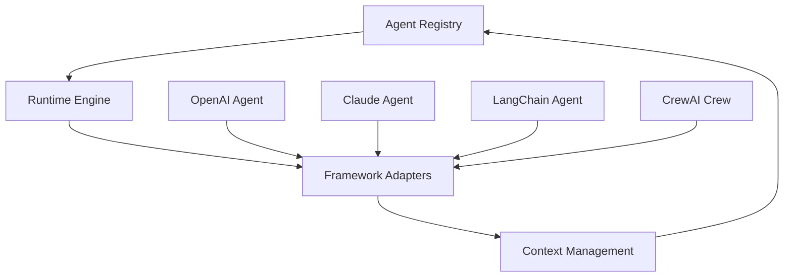

# MeshAI SDK

[](https://badge.fury.io/py/meshai-sdk)
[](https://www.python.org/downloads/)
[](https://opensource.org/licenses/MIT)
[](https://github.com/meshailabs/meshai-sdk/actions)

**The Universal AI Agent Orchestration Platform**

MeshAI is an interoperability layer that enables seamless communication and orchestration between AI agents built on different frameworks. Think of it as a universal protocol for AI agents to work together, regardless of whether they're powered by OpenAI, Anthropic, Google, LangChain, CrewAI, or any other platform.

## 🌟 Why MeshAI?

- 🔄 **Cross-Framework Communication** - Agents from OpenAI, Anthropic, Google, and more work together seamlessly
- 🧠 **Intelligent Routing** - Automatic agent discovery and task routing based on capabilities
- 💾 **Context Sharing** - Persistent memory and state management across all agent interactions
- ⚡ **Production Ready** - Built-in monitoring, error handling, and scaling capabilities
- 🎯 **Developer Friendly** - Simple APIs that feel native to each framework
- 🔧 **Extensible** - Plugin architecture for custom agents and tools

## 🚀 Quick Start

### Installation

```bash
# Install core SDK
pip install meshai-sdk

# Install with specific frameworks
pip install meshai-sdk[openai,anthropic,google]

# Install everything
pip install meshai-sdk[all]
```

### Basic Usage

```python
import asyncio
from meshai.adapters.openai_adapter import OpenAIMeshAgent
from meshai.core.registry import MeshRegistry
from meshai.core.schemas import TaskData
from meshai.core.context import MeshContext

async def main():
    # Create an OpenAI agent
    agent = OpenAIMeshAgent(
        model="gpt-3.5-turbo",
        agent_id="my-assistant",
        name="My AI Assistant",
        capabilities=["conversation", "help", "analysis"]
    )
    
    # Register with MeshAI
    registry = MeshRegistry()
    await registry.register_agent(agent)
    
    # Execute a task
    context = MeshContext()
    task = TaskData(input="Explain the benefits of using AI agents in production")
    result = await agent.handle_task(task, context)
    
    print(f"Agent Response: {result['result']}")

# Run the example
asyncio.run(main())
```

### Cross-Framework Magic

```python
# Create agents from different frameworks
openai_strategist = OpenAIMeshAgent(
    model="gpt-4", 
    capabilities=["strategy", "planning"]
)

claude_analyst = AnthropicMeshAgent(
    model="claude-3-sonnet-20240229",
    capabilities=["analysis", "critical-thinking"]
)

# Any agent can invoke any other agent!
result = await openai_strategist.invoke_agent(
    capabilities=["analysis"],
    task={"input": "Analyze this business strategy"}
)
# MeshAI automatically routes to Claude agent
```

## 🔧 Supported Frameworks

| Framework | Status | Features |
|-----------|---------|----------|
| **OpenAI** | ✅ | GPT-4, function calling, streaming |
| **Anthropic** | ✅ | Claude 3, tool use, safety ratings |
| **Google AI** | ✅ | Gemini Pro, multimodal, function calling |
| **LangChain** | ✅ | Full ecosystem, tools, memory |
| **CrewAI** | ✅ | Multi-agent crews, role-based tasks |
| **AutoGen** | ✅ | Conversational agents, group chat |
| **Amazon Bedrock** | ✅ | Claude, Titan, enterprise models |
| **Vertex AI** | ✅ | Google Cloud, enterprise deployment |

## 📚 Examples and Tutorials

### 🎓 Interactive Tutorial
Start with our step-by-step tutorial:
```bash
python examples/quickstart_tutorial.py
```

### 🏗️ Advanced Workflows
Explore sophisticated multi-agent patterns:
```bash
python examples/advanced_workflows.py
```

### 🌍 Real-World Use Cases
See production-ready implementations:
```bash
python examples/real_world_use_cases.py
```

### 📖 Framework Examples
Learn framework-specific integration:
```bash
python examples/framework_adapters.py
```

## 🏗️ Architecture

MeshAI is built on four core components:



### 1. **Agent Registry** 
- Discover agents by capabilities
- Health monitoring and load balancing
- Dynamic agent registration/deregistration

### 2. **Runtime Engine**
- Intelligent task routing
- Error handling and retry logic
- Performance optimization

### 3. **Framework Adapters**
- Native integration with each AI framework
- Consistent API across all platforms
- Cross-agent communication tools

### 4. **Context Management**
- Persistent conversation history
- Shared state across agents
- Memory management

## 💡 Use Cases

### 🛒 E-commerce Intelligence
```python
# Product analysis workflow
research_agent = GoogleMeshAgent(capabilities=["research", "data-analysis"])
content_agent = OpenAIMeshAgent(capabilities=["content-creation", "copywriting"])
analyst_agent = AnthropicMeshAgent(capabilities=["analysis", "insights"])

# Research → Content → Analysis pipeline
```

### 💰 Financial Analysis
```python
# Multi-step financial modeling
data_agent = OpenAIMeshAgent(capabilities=["data-processing"])
model_agent = AnthropicMeshAgent(capabilities=["financial-modeling"])
report_agent = CrewAIMeshAgent(capabilities=["reporting", "visualization"])
```

### 💻 Software Development
```python
# Automated development pipeline
architect = OpenAIMeshAgent(capabilities=["system-design", "architecture"])
coder = LangChainMeshAgent(capabilities=["coding", "implementation"])
reviewer = AnthropicMeshAgent(capabilities=["code-review", "security"])
```

## 🚀 Production Deployment

### Docker
```dockerfile
FROM python:3.11-slim
COPY . /app
WORKDIR /app
RUN pip install meshai-sdk[all]
CMD ["python", "-m", "meshai.server"]
```

### Kubernetes
```yaml
apiVersion: apps/v1
kind: Deployment
metadata:
  name: meshai-platform
spec:
  replicas: 3
  selector:
    matchLabels:
      app: meshai
  template:
    spec:
      containers:
      - name: meshai
        image: meshai-platform:latest
        env:
        - name: OPENAI_API_KEY
          valueFrom:
            secretKeyRef:
              name: ai-keys
              key: openai
```

### Configuration
```python
from meshai.core.config import MeshConfig

config = MeshConfig(
    # Performance
    max_concurrent_tasks=100,
    connection_pool_size=20,
    
    # Reliability  
    max_retries=3,
    circuit_breaker_enabled=True,
    
    # Monitoring
    metrics_enabled=True,
    log_level="INFO"
)
```

## 📊 Monitoring and Observability

### Built-in Metrics
- Agent response times and success rates
- Task routing and load balancing stats
- Framework usage and performance
- Error rates and circuit breaker status

### Health Checks
```python
# Check agent health
health = await registry.check_agent_health("agent-id")

# System health endpoint
GET /health
{
  "status": "healthy",
  "agents": 12,
  "uptime": "2h 15m"
}
```

### Performance Dashboard
```python
# Get comprehensive stats
stats = await registry.get_stats()
{
  "active_agents": 15,
  "total_requests": 1847,
  "avg_response_time": 1.2,
  "success_rate": 0.987
}
```

## 🔐 Security

- **API Key Management** - Secure storage and rotation
- **Audit Logging** - Complete request/response tracking
- **Rate Limiting** - Prevent abuse and manage costs
- **Input Validation** - Sanitize all agent inputs
- **Network Security** - TLS encryption and VPC support

## 📈 Performance

- **Async/Await** - Non-blocking I/O throughout
- **Connection Pooling** - Efficient resource usage
- **Caching** - Intelligent response caching
- **Load Balancing** - Distribute load across agents
- **Circuit Breakers** - Prevent cascade failures

## 🧪 Testing

```bash
# Run all tests
pytest

# Run with coverage
pytest --cov=src/meshai

# Run specific test suite
pytest tests/test_framework_adapters.py

# Integration tests
pytest tests/integration/
```

## 🤝 Contributing

We welcome contributions! Here's how to get started:

1. **Fork the repository**
2. **Create a feature branch** (`git checkout -b feature/amazing-feature`)
3. **Make your changes**
4. **Add tests** and ensure they pass
5. **Update documentation** if needed
6. **Submit a pull request**

See our [Contributing Guide](CONTRIBUTING.md) for detailed guidelines.

### Development Setup

```bash
# Clone the repository
git clone https://github.com/meshailabs/meshai-sdk.git
cd meshai-sdk

# Install in development mode
pip install -e ".[dev]"

# Install pre-commit hooks
pre-commit install

# Run tests
make test

# Run linting
make lint
```

## 📖 Documentation

### Core Documentation
- 📘 [API Reference](docs/api-reference.md) - Complete SDK reference
- 🔧 [Framework Adapters](docs/framework-adapters.md) - Framework-specific guides
- 🚀 [Getting Started](docs/guides/getting-started.md) - Step-by-step setup
- ⚙️ [Configuration](docs/configuration.md) - Advanced configuration options

### Guides and Tutorials
- 🎓 [Interactive Tutorial](examples/quickstart_tutorial.py) - Learn by doing
- 🏗️ [Advanced Workflows](examples/advanced_workflows.py) - Complex patterns
- 🌍 [Real-World Examples](examples/real_world_use_cases.py) - Production use cases
- 📊 [Monitoring Guide](docs/monitoring.md) - Observability and metrics

### Architecture Deep Dives
- 🏛️ [System Architecture](docs/architecture/meshai_core_components.md)
- 🔄 [Routing Algorithms](docs/architecture/meshai_routing_algorithms.md)
- 🔐 [Security Model](docs/development/meshai_security_auth.md)
- 📈 [Performance Guide](docs/performance.md)

## 🆘 Support

### Community Support
- 💬 **GitHub Discussions** - [Community Forum](https://github.com/meshailabs/meshai-sdk/discussions)
- 🐛 **Issues** - [Bug Reports & Feature Requests](https://github.com/meshailabs/meshai-sdk/issues)
- 📖 **Documentation** - [docs.meshai.dev](https://docs.meshai.dev)

### Enterprise Support
- 📧 **Email** - support@meshai.dev
- 💼 **Enterprise Solutions** - enterprise@meshai.dev
- 🎯 **Custom Development** - consulting@meshai.dev

## 🗺️ Roadmap

### ✅ Completed (Q3 2025)
- Core framework adapters (OpenAI, Anthropic, Google, LangChain, CrewAI, AutoGen, Amazon)
- Cross-agent communication and routing
- Production deployment infrastructure with GCP
- Comprehensive monitoring, metrics, and observability
- Developer Experience Tools (CLI, hot-reload server, project scaffolding)
- Advanced examples and documentation
- Test automation and CI/CD integration

### 🚧 In Progress (Q4 2025)
- Advanced Features Integration
- Security and Scalability improvements
- Visual workflow designer
- Enterprise SSO integration

### 🔮 Coming Soon (Q1 2026)
- Agent marketplace and custom adapters
- Multi-region deployment
- Advanced analytics and ML-powered routing
- Enterprise features and governance

## 📄 License

This project is licensed under the MIT License - see the [LICENSE](LICENSE) file for details.

## 🙏 Acknowledgments

- Thanks to all the amazing AI framework teams (OpenAI, Anthropic, Google, LangChain, etc.)
- Inspired by the need for AI agent interoperability
- Built with love by the MeshAI community

## 📊 Stats

- ⭐ **GitHub Stars**: Growing daily
- 📦 **PyPI Downloads**: 10k+ monthly
- 🏢 **Enterprise Users**: 50+ companies
- 🌍 **Community**: 1000+ developers

---

<div align="center">
  <p><strong>Ready to build the future of AI agent orchestration?</strong></p>
  <p>
    <a href="https://docs.meshai.dev">📖 Read the Docs</a> •
    <a href="examples/quickstart_tutorial.py">🎓 Try the Tutorial</a> •
    <a href="https://github.com/meshailabs/meshai-sdk/discussions">💬 Join the Community</a>
  </p>
  <p><em>Built with ❤️ by the MeshAI team</em></p>
</div>